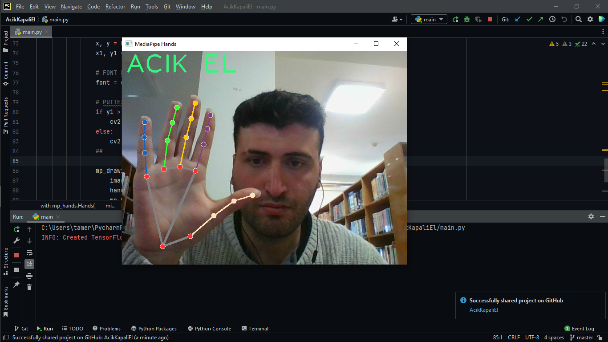

# PAYTHON İLE AÇIK - KAPALI EL TESPİTİ

### Özellikler

- Kameradan El hareketlerini izler.
- Elin Açık olup Olmamasına göre Ekrana yazar.

### Ön kurulum

`pip install mediapipe`

`pip install opencv-python`

### Kodlar ve Anlatım :

https://google.github.io/mediapipe/solutions/hands.html  sayfasından El İzleme için hazırlanmış kodları alıyoruz yazı
basma kısmına ( hemen for döngüsünün altına ) aşağıdaki kodları ekliyoruz.

#### Açik Kapalı olma durumu belirlemek için landmarkslardan 9. ve 12. noktayı alıyoruz . 12.noktanın y değerinin 9.noktanın y değerinden küçük olması durumunda

    x, y = hand_landmarks.landmark[9].x, hand_landmarks.landmark[9].y
    x1, y1 = hand_landmarks.landmark[12].x, hand_landmarks.landmark[12].y

### landmarks:

> Hand Landmarks ( El İşaretleri )

#### Font Belirledik

    font = cv2.FONT_HERSHEY_PLAIN

#### PutText methodu ile ekrana basıyoruz.

#### Landmarkslarda 12.noktanın y değerinin 9.noktanın y değerinden küçük olması durumunda "el kapalıdır " şeklinde koşul oluşturuyoruz.

     if y1 > y:
     	cv2.putText(image, "KAPALI EL", (10, 50), font, 4, (240,128,128), 3)
     else:
         cv2.putText(image, "ACIK EL", (10, 50), font, 4, (125, 246, 55), 3)

### EKRAN FOTOĞRAFLARI

>Açik El

> Kapalı El

### Son
